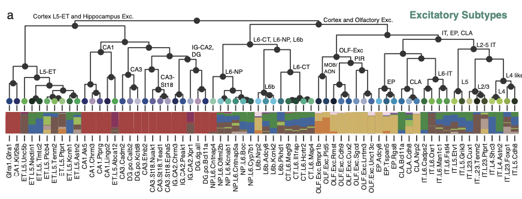

# single-cell data

Single-cell data analysis and visualization can be separated into two levels: 1\) cell level; 2\) cluster or pseudo-bulk level. The second level is much like bulk-seq analysis, and the first level is technology-specific. Here in this book, I provide you a summary table from my project. In this project, we sequenced &gt;100,000 single nuclei from 45 adult mouse brain regions using our single-nuclei methylome sequencing technology \([Original paper](https://www.ncbi.nlm.nih.gov/pubmed/28798132) and [updated version](https://www.nature.com/articles/s41467-018-06355-2)\). 

I will not go through the analysis details because its a rather large topic that's beyond the scope of this book. Check this manuscript \(ADD LINK\) if you are interested. In this book, you can imagine that this dataset is equal to any other single-cell datasets, such as scRNA-seq, scATAC-seq, etc.


The single-cell data I used here is a reduced dataset that's basically **a large table, where each row is a cell's information, each column is a kind of metadata/computed variable**. This dataset by no means covered all aspects of single-cell data analysis but just trying to emphasize on data visualization principles.


## Data visualization and Data Cleaning

In order to do great data visualization, you first need to be skilled on data cleaning. Because the first step of any data visualization is to reformat/summarize your data into a format that's suitable for your visualization purpose. Therefore, here I use this complex single-cell table, and show you step by step how those beautiful figures from single-cell papers are made from scratch. 

The single-cell analysis part is about how this table is generated, which is not covered, but I provide [some resources](mouse-brain-mop-single-nucleus-smart-seq.md#single-cell-data-analysis) if you are interested \(warning: that's a large topic\).


## Some examples and their purpose


I will remake all these figures from scratch, all of them are purely plotted with python.


### Categorical or continuous variable on certain coordinates

* How to visually map a variable
* How to control color, size, and other aspects of the scatter plot


### Hierarchical categories organized by Sunburst

* How simple plot type \(pie chart\) can be combined into a fancy new plot
* This plot needs a lot data cleaning techniques


### Fancy Tree

* How to control panel layout, combine multiple plots into same panel
* How to build a tree \(or any other structure\) from scratch



## Get this dataset

All files are included in the [Github repository](https://github.com/lhqing/py_genome_sci_book) of this book. 

```text
# if you haven't got the github repo
git clone https://github.com/lhqing/py_genome_sci_book.git
# if you already did, git pull will update it
git pull

cd py_genome_sci_book/data/snmC-seq2
# where the data locates
```

## Single cell data analysis

Although not covered in this book, here, I recommend some resources to learn more about single-cell RNA-seq data analysis. For epigenomic data, such as DNA methylation, I plan to write a detailed book in the future.

* [Scanpy](https://scanpy-tutorials.readthedocs.io/en/latest/pbmc3k.html), the most popular python package for single-cell data analysis
* [Single-cell RNA-seq data analysis tutorial](https://github.com/theislab/single-cell-tutorial) from Thesis lab
* [Seurat](https://satijalab.org/seurat/), the most popular R package for single-cell data analysis


